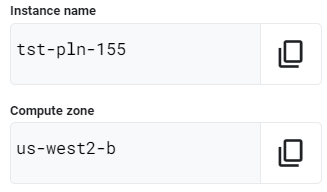
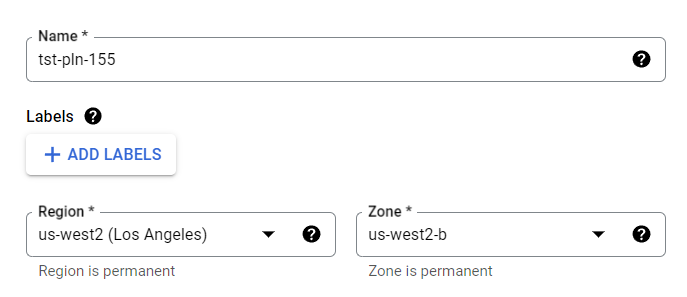
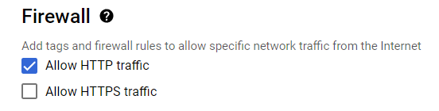

# [GSP101] Google Cloud Essential Skills: Challenge Lab

### [GSP101](https://www.cloudskillsboost.google/focuses/1734?parent=catalog)


---

Time: 45 minutes<br>
Difficulty: Intermediate<br>
Price: 5 Credits

Quest: [Cloud Architecture: Design, Implement, and Manage](https://www.cloudskillsboost.google/quests/124)<br>

Last updated: May 26, 2023

---

## Challenge scenario

Your company is ready to launch a brand new product! Because you are entering a totally new space, you have decided to deploy a new website as part of the product launch. The new site is complete, but the person who built the new site left the company before they could deploy it.

## Your challenge

Your challenge is to deploy the site in the public cloud by completing the tasks below. You will use a simple Apache web server as a placeholder for the new site in this exercise. Good luck!

1. Create a Compute Engine instance, add necessary firewall rules.

    - In the **Cloud Console**, click the **Navigation menu** > **Compute Engine** > **VM Instances**.
    - Click **Create instance**.
    - Set the following values, leave all other values at their defaults:

        | Property | Value (type value or select option as specified) |
        | --- | --- |
        | Name | `INSTANCE_NAME` |
        | Zone | `COMPUTE_ZONE` |

        

        

    - Under **Firewall** check **Allow HTTP traffic**.
        
    - Click **Create**.

2. Configure Apache2 Web Server in your instance.

    - In the **Cloud Console**, click the **Navigation menu** > **Compute Engine** > **VM Instances**.
    - Click on the SSH button next to `INSTANCE_NAME` instance.
    - Run the following command:

        ```bash
        sudo su -
        ```

        then run:

        ```bash
        apt-get update
        apt-get install apache2 -y

        service --status-all
        ```

3. Test your server.

    - In the **Cloud Console**, click the **Navigation menu** > **Compute Engine** > **VM Instances**.
    - Access the VM using an https address. Check that your URL is http:// EXTERNAL_IP and not https:// EXTERNAL_IP
    - Verify **Apache2 Debian Default Page** showed up.

## Congratulations!


