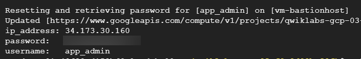
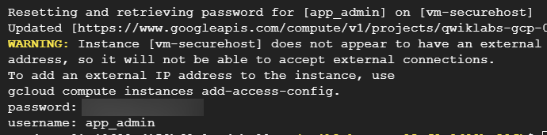
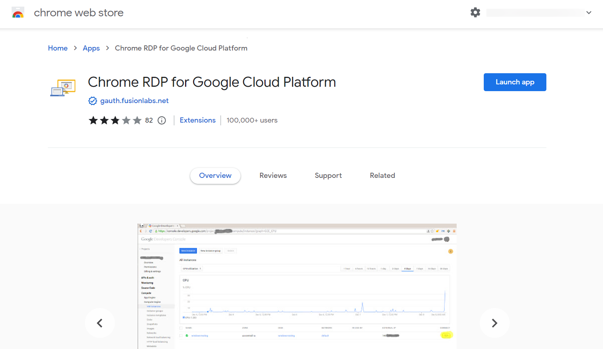
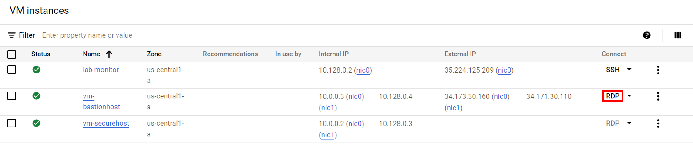
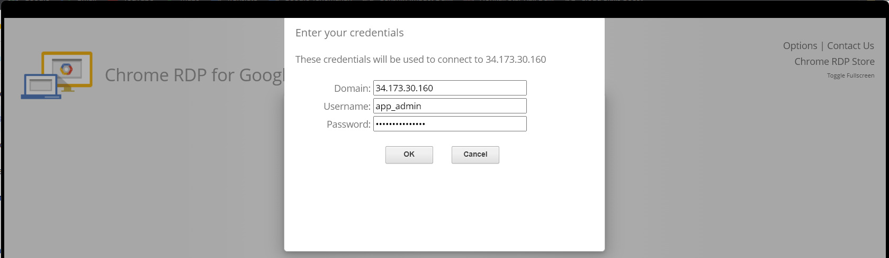
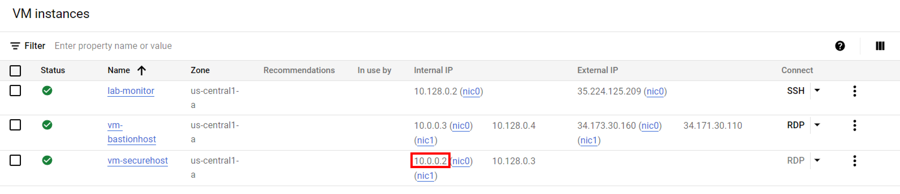
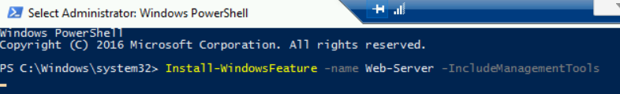
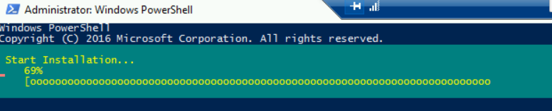

# [GSP303] Configure Secure RDP using a Windows Bastion Host

### [GSP303](https://www.cloudskillsboost.google/focuses/1737?parent=catalog)


---

Time: 1 hour<br>
Difficulty: Intermediate<br>
Price: 5 Credits

Quest: [Cloud Architecture: Design, Implement, and Manage](https://www.cloudskillsboost.google/quests/124)<br>

Last updated: Sep 7, 2023

---

## Challenge scenario

Your company has decided to deploy new application services in the cloud and your assignment is developing a secure framework for managing the Windows services that will be deployed. You will need to create a new VPC network environment for the secure production Windows servers.

Production servers must initially be completely isolated from external networks and cannot be directly accessed from, or be able to connect directly to, the internet. In order to configure and manage your first server in this environment, you will also need to deploy a bastion host, or jump box, that can be accessed from the internet using the Microsoft Remote Desktop Protocol (RDP). The bastion host should only be accessible via RDP from the internet, and should only be able to communicate with the other compute instances inside the VPC network using RDP.

Your company also has a monitoring system running from the default VPC network, so all compute instances must have a second network interface with an internal only connection to the default VPC network.

## Your challenge

Deploy the secure Windows machine that is not configured for external communication inside a new VPC subnet, then deploy the Microsoft Internet Information Server on that secure machine.

## Task 1. Create the VPC network

1. Create a new VPC network called `securenetwork`

    Go to cloud shell and run the following command:

    ```bash
    gcloud compute networks create securenetwork --project=$DEVSHELL_PROJECT_ID --subnet-mode=custom --mtu=1460 --bgp-routing-mode=regional
    ```

2. Then create a new VPC subnet inside `securenetwork`

    ```bash
    gcloud compute networks subnets create secure-subnet --project=$DEVSHELL_PROJECT_ID --range=10.0.0.0/24 --stack-type=IPV4_ONLY --network=securenetwork --region=us-central1
    ```

3. Once the network and subnet have been configured, configure a firewall rule that allows inbound RDP traffic (`TCP port 3389`) from the internet to the bastion host. This rule should be applied to the appropriate host using network tags.

    ```bash
    gcloud compute --project=$DEVSHELL_PROJECT_ID firewall-rules create secuer-firewall --direction=INGRESS --priority=1000 --network=securenetwork --action=ALLOW --rules=tcp:3389 --source-ranges=0.0.0.0/0 --target-tags=rdp
    ```

## Task 2. Deploy your Windows instances and configure user passwords

1. Deploy a Windows 2016 server instance called `vm-securehost` with two network interfaces.
2. Configure the first network interface with an internal only connection to the new VPC subnet, and the second network interface with an internal only connection to the default VPC network. This is the secure server.

    ```bash
    gcloud compute instances create vm-securehost --project=$DEVSHELL_PROJECT_ID --zone=us-central1-a --machine-type=n1-standard-2 --network-interface=stack-type=IPV4_ONLY,subnet=secure-subnet,no-address --network-interface=stack-type=IPV4_ONLY,subnet=default,no-address --metadata=enable-oslogin=true --maintenance-policy=MIGRATE --provisioning-model=STANDARD --tags=rdp --create-disk=auto-delete=yes,boot=yes,device-name=vm-securehost,image=projects/windows-cloud/global/images/windows-server-2016-dc-v20230510,mode=rw,size=150,type=projects/$DEVSHELL_PROJECT_ID/zones/us-central1-a/diskTypes/pd-standard --no-shielded-secure-boot --shielded-vtpm --shielded-integrity-monitoring --labels=goog-ec-src=vm_add-gcloud --reservation-affinity=any
    ```

3. Install a second Windows 2016 server instance called `vm-bastionhost` with two network interfaces.
4. Configure the first network interface to connect to the new VPC subnet with an ephemeral public (external NAT) address, and the second network interface with an internal only connection to the default VPC network. This is the jump box or bastion host.

    ```bash
    gcloud compute instances create vm-bastionhost --project=$DEVSHELL_PROJECT_ID --zone=us-central1-a --machine-type=n1-standard-2 --network-interface=network-tier=PREMIUM,stack-type=IPV4_ONLY,subnet=secure-subnet --network-interface=network-tier=PREMIUM,stack-type=IPV4_ONLY,subnet=default --metadata=enable-oslogin=true --maintenance-policy=MIGRATE --provisioning-model=STANDARD --tags=rdp --create-disk=auto-delete=yes,boot=yes,device-name=vm-securehost,image=projects/windows-cloud/global/images/windows-server-2016-dc-v20230510,mode=rw,size=150,type=projects/$DEVSHELL_PROJECT_ID/zones/us-central1-a/diskTypes/pd-standard --no-shielded-secure-boot --shielded-vtpm --shielded-integrity-monitoring --labels=goog-ec-src=vm_add-gcloud --reservation-affinity=any
    ```

5. After your Windows instances have been created, create a user account and reset the Windows passwords in order to connect to each instance.
6. The following `gcloud` command creates a new user called `app-admin` and resets the password for a host called `vm-bastionhost` and `vm-securehost` located in the `us-central1-a` region:

   ```bash
   gcloud compute reset-windows-password vm-bastionhost --user app_admin --zone us-central1-a
   ```

   

   > **Note**: Take note of the password that is generated for the user account. You will need this to connect to the bastion host.

   ```bash
   gcloud compute reset-windows-password vm-securehost --user app_admin --zone us-central1-a
   ```

   

   > **Note**: Take note of the password that is generated for the user account. You will need this to connect to the secure host.

7. Alternatively, you can force a password reset from the Compute Engine console. You will have to repeat this for the second host as the login credentials for that instance will be different.

## Task 3. Connect to the secure host and configure Internet Information Server

To connect to the secure host, you have to RDP into the bastion host first, and from there open a second RDP session to connect to the internal private network address of the secure host. A Windows Compute Instance with an external address can be connected to via RDP using the RDP button that appears next to Windows Compute instances in the Compute Instance summary page.

1. Connect to the bastion host using the RDP button in the Compute Engine console.

    You can install [Chrome RDP](https://chrome.google.com/webstore/detail/chrome-rdp-for-google-clo/mpbbnannobiobpnfblimoapbephgifkm) extension for Google Cloud Platform

    

2. Go to Compute Engine > VM instances, click RDP on `vm-bastionhost`, fill username with app_admin and password with your copied `vm-bastionhost`'s password.

    

    

    When connected to a Windows server, you can launch the Microsoft RDP client using the command `mstsc.exe`, or you can search for `Remote Desktop Manager` from the Start menu. This will allow you to connect from the bastion host to other compute instances on the same VPC even if those instances do not have a direct internet connection themselves.

3. Click Search, search for Remote Desktop Connection and run it
4. Copy and paste the internal ip from `vm-securehost`, click Connect

    

5. Fill username with app_admin and password with your copied `vm-securehost`'s password
6. Click Search, type Powershell, right click and Run as Administrator
7. Run the following command to install IIS (Internet Information Server) :

   ```powershell
   Install-WindowsFeature -name Web-Server -IncludeManagementTools
   ```

    

    

## Congratulations!


<div style="display: flex; justify-content: space-between;">
    <a style="text-align: left;" href="../GSP301/index.md"><= PREV (GSP301)</a>
    <a style="text-align: right;" href="../GSP304/index.md">NEXT (GSP304) =></a>
</div>
<br>

[HOME](../../README.md)
