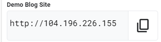
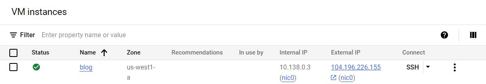
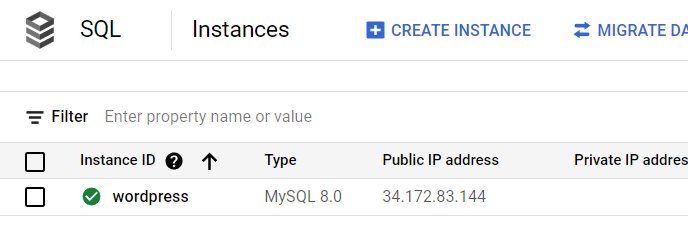
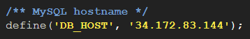
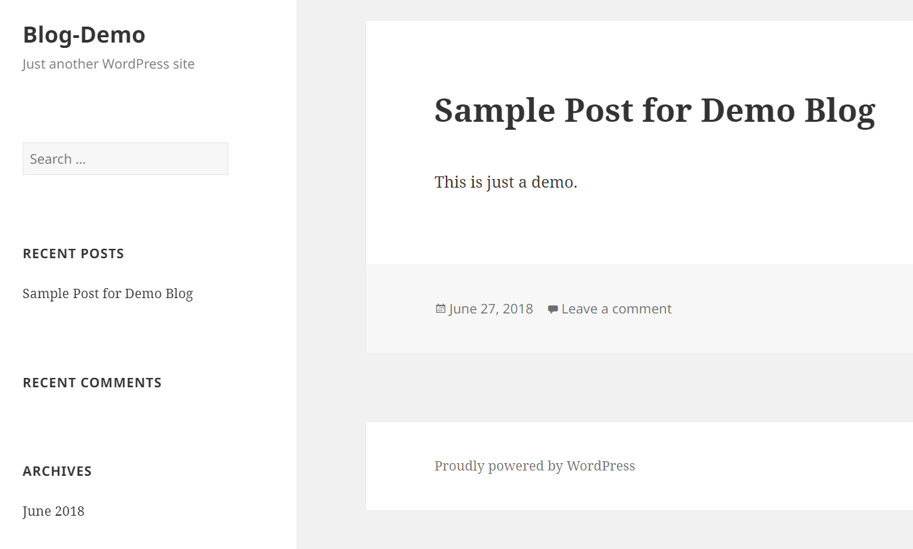

# [GSP306] Migrate a MySQL Database to Google Cloud SQL

### [GSP306](https://www.cloudskillsboost.google/focuses/1740?parent=catalog)


---

Time: 1 hour 15 minutes<br>
Difficulty: Advanced<br>
Price: 7 Credits

Quest: [Cloud Architecture: Design, Implement, and Manage](https://www.cloudskillsboost.google/quests/124)<br>

Last updated: May 25, 2023

---

## Challenge scenario

Your WordPress blog is running on a server that is no longer suitable. As the first part of a complete migration exercise, you are migrating the locally hosted database used by the blog to Cloud SQL.

The existing WordPress installation is installed in the `/var/www/html/wordpress` directory in the instance called `blog` that is already running in the lab. You can access the blog by opening a web browser and pointing to the external IP address of the blog instance.

The existing database for the blog is provided by MySQL running on the same server. The existing MySQL database is called `wordpress` and the user called **blogadmin** with password __Password1*__, which provides full access to that database.

## Your challenge

- You need to create a new Cloud SQL instance to host the migrated database
- Once you have created the new database and configured it, you can then create a database dump of the existing database and import it into Cloud SQL.
- When the data has been migrated, you will then reconfigure the blog software to use the migrated database.

For this lab, the WordPress site configuration file is located here: `/var/www/html/wordpress/wp-config.php.`

To sum it all up, your challenge is to migrate the database to Cloud SQL and then reconfigure the application so that it no longer relies on the local MySQL database. Good luck!

1. Check that there is a Cloud SQL instance.

    Go to cloud shell and run the following command:

    ```bash
    export ZONE=us-central1-a

    gcloud sql instances create wordpress --tier=db-n1-standard-1 --activation-policy=ALWAYS --zone $ZONE
    ```

    > **Note**: It will take a several times to create the instance.

    Run the following command:

    ```bash
    export ADDRESS=[IP_ADDRESS]/32
    ```

    Change the `[IP_ADDRESS]` with IP Address from `Demo Blog Site` field

    

    or from the External IP of the `blog` instance in VM Compute Engine.

    

    For example:

    ```bash
    export ADDRESS=104.196.226.155/32
    ```

    Run the following command:

    ```bash
    gcloud sql users set-password --host % root --instance wordpress --password Password1*

    gcloud sql instances patch wordpress --authorized-networks $ADDRESS --quiet
    ```

2. Check that there is a user database on the Cloud SQL instance.

    - In the **Cloud Console**, click the **Navigation menu** > **Compute Engine** > **VM Instances**.
    - Click on the SSH button next to `blog` instance.
    - Run the following command:

    ```bash
    MYSQLIP=$(gcloud sql instances describe wordpress --format="value(ipAddresses.ipAddress)")

    mysql --host=$MYSQLIP \
        --user=root --password
    ```

    > **Note**: Enter the password with __Password1*__

    And then run the following command:

    ```sql
    CREATE DATABASE wordpress;
    CREATE USER 'blogadmin'@'%' IDENTIFIED BY 'Password1*';
    GRANT ALL PRIVILEGES ON wordpress.* TO 'blogadmin'@'%';
    FLUSH PRIVILEGES;
    ```

    - type `exit` to exit the mysql shell.

3. Check that the blog instance is authorized to access Cloud SQL.

    In the `blog` SSH instance, run the following command:

    ```bash
    sudo mysqldump -u root -p Password1* wordpress > wordpress_backup.sql

    mysql --host=$MYSQLIP --user=root -pPassword1* --verbose wordpress < wordpress_backup.sql

    sudo service apache2 restart
    ```

4. Check that wp-config.php points to the Cloud SQL instance.
    - Run the following command:

        ```bash
        cd /var/www/html/wordpress/

        sudo nano wp-config.php
        ```

    - Replace `localhost` string on `DB_HOST` with **Public IP address** of SQL Instance that has copied before.

    

    From this:

    

    To this:

    

    - Press **Ctrl + O** and then press **Enter** to save your edited file. Press **Ctrl + X** to exit the nano editor.
    - Exit the SSH.

5. Check that the blog still responds to requests.

    - In the **Cloud Console**, click the **Navigation menu** > **Compute Engine** > **VM Instances**.
    - Click the **External IP** of the `blog` instance.
    - Verify that no error.

    

## Congratulations!


<div style="display: flex; justify-content: space-between;">
    <a style="text-align: left;" href="../GSP305/index.md"><= PREV (GSP305)</a>
    <a style="text-align: right;" href="../GSP313/index.md">NEXT (GSP313) =></a>
</div>
<br>

[HOME](../../README.md)
