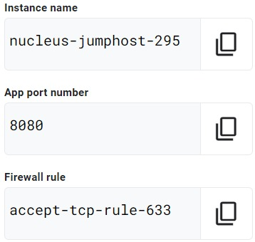
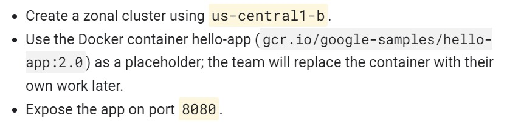
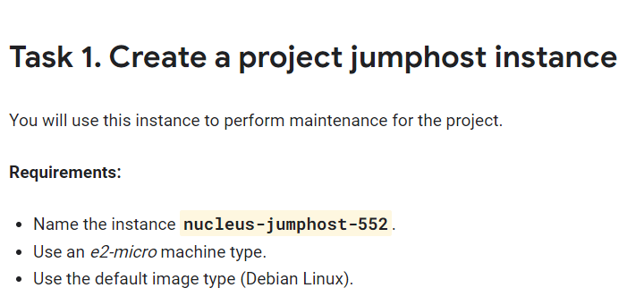

# [GSP313] Create and Manage Cloud Resources: Challenge Lab

### [GSP313](https://www.cloudskillsboost.google/focuses/10258?parent=catalog)


---

Time: 1 hour<br>
Difficulty: Introductory<br>
Price: 1 Credit

Quest: [Create and Manage Cloud Resources](https://www.cloudskillsboost.google/quests/120)<br>

Last updated: May 22, 2023

---

## Challenge scenario

You have started a new role as a Junior Cloud Engineer for Jooli, Inc. You are expected to help manage the infrastructure at Jooli. Common tasks include provisioning resources for projects.

You are expected to have the skills and knowledge for these tasks, so step-by-step guides are not provided.

Some Jooli, Inc. standards you should follow:

Create all resources in the default region or zone, unless otherwise directed.

Naming normally uses the format _team-resource_; for example, an instance could be named **nucleus-webserver1**.

Allocate cost-effective resource sizes. Projects are monitored, and excessive resource use will result in the containing project's termination (and possibly yours), so plan carefully. This is the guidance the monitoring team is willing to share: unless directed, use **f1-micro** for small Linux VMs, and use **n1-standard-1** for Windows or other applications, such as Kubernetes nodes.

## Your challenge

As soon as you sit down at your desk and open your new laptop, you receive several requests from the Nucleus team. Read through each description, and then create the resources.

## Setup

Export the following environment variables using the values specific to your labs instruction.

```bash
export INSTANCE_NAME=
export ZONE=
export REGION=
export PORT=
export FIREWALL_NAME=
```



You can find the zone in Task 2 description.



Region is just the first part of the zone. For example, if the zone is `us-east1-b`, then the region is `us-east1`.

Example:

```bash
export INSTANCE_NAME=nucleus-jumphost-295
export ZONE=us-central1-b
export REGION=us-central1
export PORT=8080
export FIREWALL_NAME=accept-tcp-rule-633
```

## Task 1. Create a project jumphost instance

**_Beware with machine-type, maybe have different with me, dont forget to change_**<br>


Go to cloud shell and run the following command:

```bash
gcloud compute instances create $INSTANCE_NAME \
          --network nucleus-vpc \
          --zone $ZONE  \
          --machine-type e2-micro  \
          --image-family debian-10  \
          --image-project debian-cloud
```

## Task 2. Create a Kubernetes service cluster

Go to cloud shell and run the following command:

```bash
gcloud container clusters create nucleus-backend \
--num-nodes 1 \
--network nucleus-vpc \
--zone $ZONE

gcloud container clusters get-credentials nucleus-backend \
--zone $ZONE
```

- Use the Docker container hello-app (`gcr.io/google-samples/hello-app:2.0`) as place holder.

```bash
kubectl create deployment hello-server \
--image=gcr.io/google-samples/hello-app:2.0
```

- Expose the app on port `APP_PORT_NUMBER`.

```bash
kubectl expose deployment hello-server \
--type=LoadBalancer \
--port $PORT
```

## Task 3. Set up an HTTP load balancer

1. Create startup-script.

   ```bash
   cat << EOF > startup.sh
   #! /bin/bash
   apt-get update
   apt-get install -y nginx
   service nginx start
   sed -i -- 's/nginx/Google Cloud Platform - '"\$HOSTNAME"'/' /var/www/html/index.nginx-debian.html
   EOF
   ```

2. Create instance template.

   ```bash
   gcloud compute instance-templates create web-server-template \
   --metadata-from-file startup-script=startup.sh \
   --network nucleus-vpc \
   --machine-type g1-small \
   --region $ZONE
   ```

3. Create target pool.

   ```bash
   gcloud compute target-pools create nginx-pool --region=$REGION
   ```

4. Create managed instance group.

   ```bash
   gcloud compute instance-groups managed create web-server-group \
   --base-instance-name web-server \
   --size 2 \
   --template web-server-template \
   --region $REGION
   ```

5. Create firewall rule named as `FIREWALL_RULE` to allow traffic (80/tcp).

   ```bash
   gcloud compute firewall-rules create $FIREWALL_NAME \
   --allow tcp:80 \
   --network nucleus-vpc
   ```

6. Create health check.

   ```bash
   gcloud compute http-health-checks create http-basic-check
   gcloud compute instance-groups managed \
   set-named-ports web-server-group \
   --named-ports http:80 \
   --region $REGION
   ```

7. Create backend service, and attach the managed instance group with named port (http:80).

   ```bash
   gcloud compute backend-services create web-server-backend \
   --protocol HTTP \
   --http-health-checks http-basic-check \
   --global

   gcloud compute backend-services add-backend web-server-backend \
   --instance-group web-server-group \
   --instance-group-region $REGION \
   --global
   ```

8. Create URL map and target the HTTP proxy to route requests to your URL map.

   ```bash
   gcloud compute url-maps create web-server-map \
   --default-service web-server-backend

   gcloud compute target-http-proxies create http-lb-proxy \
   --url-map web-server-map
   ```

9. Create forwarding rule.

   ```bash
   gcloud compute forwarding-rules create http-content-rule \
   --global \
   --target-http-proxy http-lb-proxy \
   --ports 80

   gcloud compute forwarding-rules create $FIREWALL_NAME \
   --global \
   --target-http-proxy http-lb-proxy \
   --ports 80
   gcloud compute forwarding-rules list
   ```

> **Note**: Just wait for the load balancer to finish setting up. It may take a few minutes. If you get an error checkmark, wait a few moments and try again.

10. Testing traffic sent to your instances. (**Optional**)

- In the **Cloud Console**, click the **Navigation menu** > **Network services** > **Load balancing**.
- Click on the load balancer that you just created (`web-server-map`).
- In the **Backend** section, click on the name of the backend and confirm that the VMs are **Healthy**. If they are not healthy, wait a few moments and try reloading the page.
- When the VMs are healthy, test the load balancer using a web browser, going to `http://IP_ADDRESS/`, replacing `IP_ADDRESS` with the load balancer's IP address.

## Congratulations!


<div style="display: flex; justify-content: space-between;">
    <a style="text-align: left;" href="../GSP306/index.md"><= PREV (GSP306)</a>
    <a style="text-align: right;" href="../GSP315/index.md">NEXT (GSP315) =></a>
</div>
<br>

[HOME](../../README.md)
