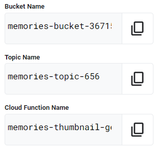
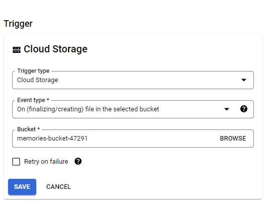
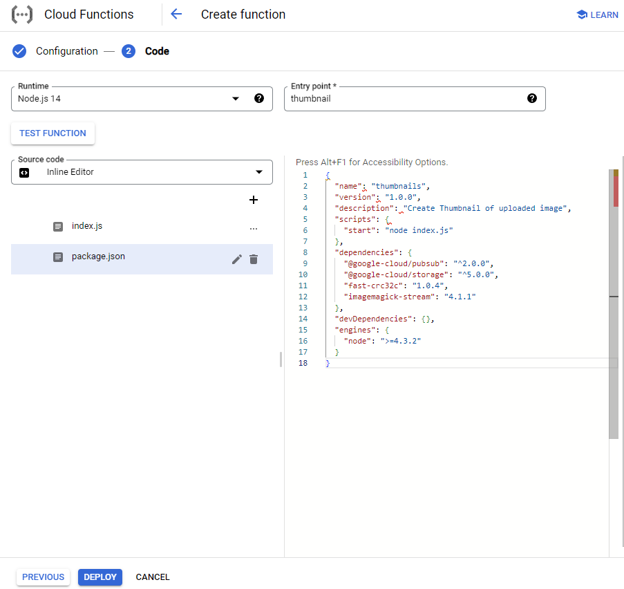

# [GSP315] Perform Foundational Infrastructure Tasks in Google Cloud: Challenge Lab

### [GSP315](https://www.cloudskillsboost.google/focuses/10379?parent=catalog)


---

Time: 1 hour<br>
Difficulty: Introductory<br>
Price: 1 Credit

Quest: [Perform Foundational Infrastructure Tasks in Google Cloud](https://www.cloudskillsboost.google/quests/118)<br>

Last updated: May 21, 2023

---

## Challenge scenario

You are just starting your junior cloud engineer role with Jooli inc. So far you have been helping teams create and manage Google Cloud resources.

You are expected to have the skills and knowledge for these tasks so don’t expect step-by-step guides.

## Your challenge

You are now asked to help a newly formed development team with some of their initial work on a new project around storing and organizing photographs, called memories. You have been asked to assist the memories team with initial configuration for their application development environment; you receive the following request to complete the following tasks:

- Create a bucket for storing the photographs.
- Create a Pub/Sub topic that will be used by a Cloud Function you create.
- Create a Cloud Function.
- Remove the previous cloud engineer’s access from the memories project.

Some Jooli Inc. standards you should follow:

- Create all resources in the **us-east1** region and **us-east1-b** zone, unless otherwise directed.
- Use the project VPCs.
- Naming is normally _team-resource_, e.g. an instance could be named **kraken-webserver1**.
- Allocate cost effective resource sizes. Projects are monitored and excessive resource use will result in the containing project's termination (and possibly yours), so beware. This is the guidance the monitoring team is willing to share; unless directed, use **f1-micro** for small Linux VMs and **n1-standard-1** for Windows or other applications such as Kubernetes nodes.

Each task is described in detail below, good luck!

## Task 1. Create a bucket

- You need to create a bucket called `Bucket Name` for the storage of the photographs.

Go to cloud shell and run the following command to create a bucket.

Replace `[BUCKET_NAME]` with the name of the bucket in the lab instructions.



```bash
gsutil mb gs://[BUCKET_NAME]/
```

## Task 2. Create a Pub/Sub topic

- Create a Pub/Sub topic called `Topic Name` for the Cloud Function to send messages.

Go to cloud shell and run the following command to create a Pub/Sub topic.

Replace `[TOPIC_NAME]` with the name of the bucket in the lab instructions.

```bash
gcloud pubsub topics create [TOPIC_NAME]
```

## Task 3. Create the thumbnail Cloud Function

1. In the **Cloud Console**, click the **Navigation menu** > **Cloud Functions**.
2. Click **Create function**.
3. In the **Create function** dialog, enter the following values:

   - Function Name: `CLOUD_FUNCTION_NAME`, change the name of the function in the lab instructions.
   - Trigger: Cloud Storage
   - Event Type: Finalizing/Creating
   - Bucket: `BUCKET_NAME`

     

   - Click **_Save_**.
   - Click **_Next_**.
   - Runtime: Node.js 14
   - Entry Point (Function to execute): thumbnail
   - Source Code: Inline editor
   - Replace code for index.js and package.json

     In `line 15` of `index.js` replace the text **REPLACE_WITH_YOUR_TOPIC_NAME** with the `TOPIC_NAME` you created in task 2.

     `index.js`:

     ```JavaScript
     /* globals exports, require */
     //jshint strict: false
     //jshint esversion: 6
     "use strict";
     const crc32 = require("fast-crc32c");
     const { Storage } = require('@google-cloud/storage');
     const gcs = new Storage();
     const { PubSub } = require('@google-cloud/pubsub');
     const imagemagick = require("imagemagick-stream");
     exports.thumbnail = (event, context) => {
       const fileName = event.name;
       const bucketName = event.bucket;
       const size = "64x64"
       const bucket = gcs.bucket(bucketName);
       const topicName = "REPLACE_WITH_YOUR_TOPIC_NAME";
       const pubsub = new PubSub();
       if ( fileName.search("64x64_thumbnail") == -1 ){
         // doesn't have a thumbnail, get the filename extension
         var filename_split = fileName.split('.');
         var filename_ext = filename_split[filename_split.length - 1];
         var filename_without_ext = fileName.substring(0, fileName.length - filename_ext.length );
         if (filename_ext.toLowerCase() == 'png' || filename_ext.toLowerCase() == 'jpg'){
           // only support png and jpg at this point
           console.log(`Processing Original: gs://${bucketName}/${fileName}`);
           const gcsObject = bucket.file(fileName);
           let newFilename = filename_without_ext + size + '_thumbnail.' + filename_ext;
           let gcsNewObject = bucket.file(newFilename);
           let srcStream = gcsObject.createReadStream();
           let dstStream = gcsNewObject.createWriteStream();
           let resize = imagemagick().resize(size).quality(90);
           srcStream.pipe(resize).pipe(dstStream);
           return new Promise((resolve, reject) => {
             dstStream
               .on("error", (err) => {
                 console.log(`Error: ${err}`);
                 reject(err);
               })
               .on("finish", () => {
                 console.log(`Success: ${fileName} → ${newFilename}`);
                   // set the content-type
                   gcsNewObject.setMetadata(
                   {
                     contentType: 'image/'+ filename_ext.toLowerCase()
                   }, function(err, apiResponse) {});
                   pubsub
                     .topic(topicName)
                     .publisher()
                     .publish(Buffer.from(newFilename))
                     .then(messageId => {
                       console.log(`Message ${messageId} published.`);
                     })
                     .catch(err => {
                       console.error('ERROR:', err);
                     });
               });
           });
         }
         else {
           console.log(`gs://${bucketName}/${fileName} is not an image I can handle`);
         }
       }
       else {
         console.log(`gs://${bucketName}/${fileName} already has a thumbnail`);
       }
     };
     ```

     Look like this:

     

     `package.json`:

     ```json
     {
       "name": "thumbnails",
       "version": "1.0.0",
       "description": "Create Thumbnail of uploaded image",
       "scripts": {
         "start": "node index.js"
       },
       "dependencies": {
         "@google-cloud/pubsub": "^2.0.0",
         "@google-cloud/storage": "^5.0.0",
         "fast-crc32c": "1.0.4",
         "imagemagick-stream": "4.1.1"
       },
       "devDependencies": {},
       "engines": {
         "node": ">=4.3.2"
       }
     }
     ```

     Like this:

     

   - Click **Deploy**.

4. Download this [image](https://storage.googleapis.com/cloud-training/gsp315/map.jpg).
5. In the console, click the **Navigation menu** > **Cloud Storage** > **Buckets**.
6. Click the name of the bucket that you created.
7. In the **Objects** tab, click **Upload files**.
8. In the file dialog, go to the file that you downloaded and select it.
9. Click **Refresh Bucket**.
10. Verify that the thumbnail image was created.
11. If you getting error, you can upload the image again.

## Task 4. Remove the previous cloud engineer

1. In the console, click the **Navigation menu** > **IAM & Admin** > **IAM**.
2. Search for the previous cloud engineer (`Username 2` with the role of Viewer).
3. Click the **pencil icon** to edit, and then select the **trash icon** to delete role.
4. Click **Save**.

## Congratulations!


<div style="display: flex; justify-content: space-between;">
    <a style="text-align: left;" href="../GSP313/index.md"><= PREV (GSP313)</a>
    <a style="text-align: right;" href="../GSP319/index.md">NEXT (GSP319) =></a>
</div>
<br>

[HOME](../../README.md)
