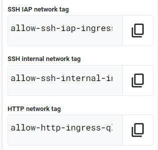
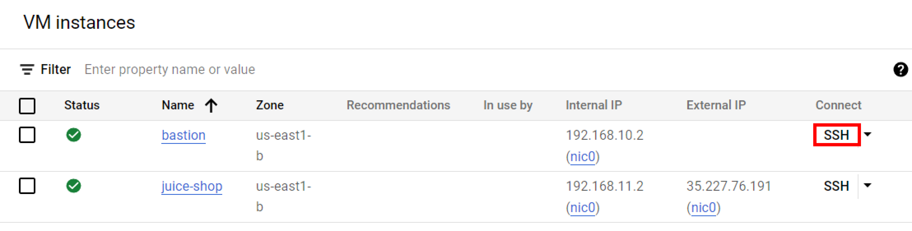
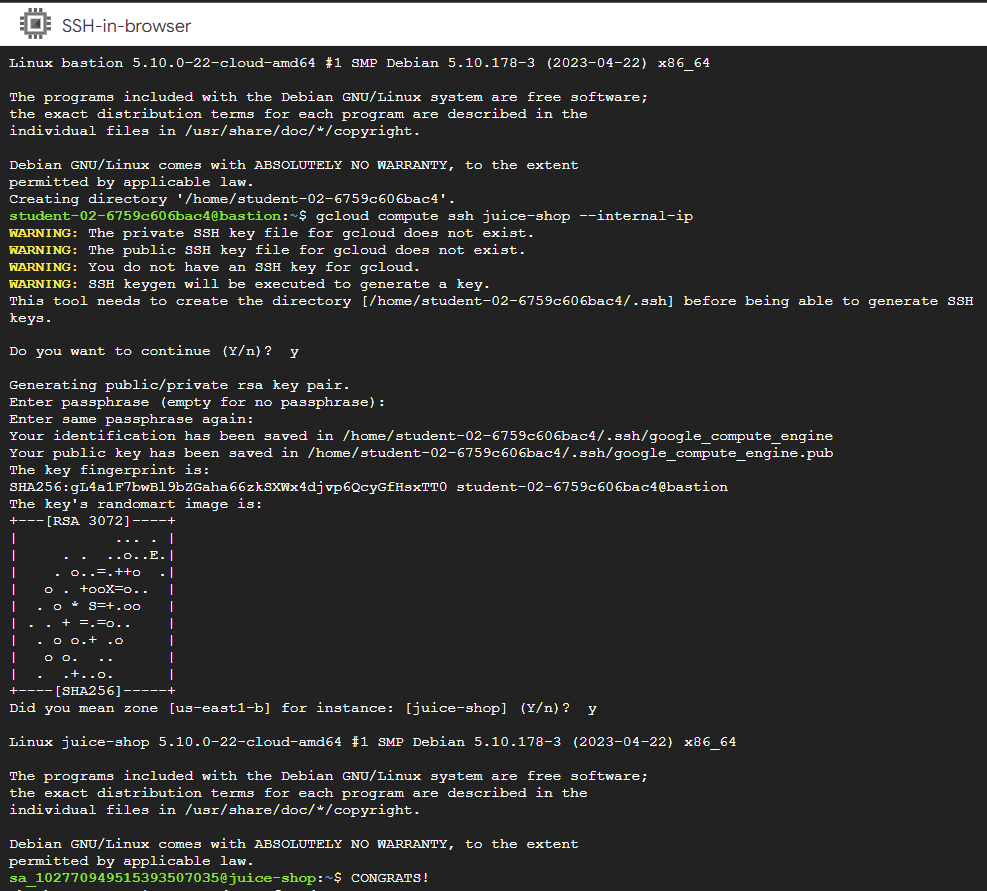

# [GSP322] Build and Secure Networks in Google Cloud: Challenge Lab

### [GSP322](https://www.cloudskillsboost.google/focuses/12068?parent=catalog)


---

Time: 1 hour<br>
Difficulty: Advanced<br>
Price: 7 Credits

Quest: [Build and Secure Networks in Google Cloud](https://www.cloudskillsboost.google/quests/128)<br>

Last updated: May 26, 2023

---

## Setup

Define the environment variables:

```bash
export IAP_NETWORK_TAG=
export INTERNAL_NETWORK_TAG=
export HTTP_NETWORK_TAG=
export ZONE=
```

Fill the variables with the values from the lab

For the zone you can use any zone. In my case I used `us-east1-b`

To list all available zones:

```bash
gcloud compute zones list
```

Reference: [gcloud compute zones list](https://cloud.google.com/sdk/gcloud/reference/compute/zones/list)



For example in my case:

```bash
export IAP_NETWORK_TAG=allow-ssh-iap-ingress-ql-901
export INTERNAL_NETWORK_TAG=allow-ssh-internal-ingress-ql-803
export HTTP_NETWORK_TAG=allow-http-ingress-ql-982
export ZONE=us-east1-b
```

## Challenge scenario

You are a security consultant brought in by Jeff, who owns a small local company, to help him with his very successful website (juiceshop). Jeff is new to Google Cloud and had his neighbour's son set up the initial site. The neighbour's son has since had to leave for college, but before leaving, he made sure the site was running.

You need to help out Jeff and perform appropriate configuration for security. Below is the current situation:


## Your challenge

You need to configure this simple environment securely. Your first challenge is to set up appropriate firewall rules and virtual machine tags. You also need to ensure that SSH is only available to the bastion via IAP.

For the firewall rules, make sure:

- The bastion host does not have a public IP address.
- You can only SSH to the bastion and only via IAP.
- You can only SSH to juice-shop via the bastion.
- Only HTTP is open to the world for `juice-shop`.

Tips and tricks:

- Pay close attention to the network tags and the associated VPC firewall rules.
- Be specific and limit the size of the VPC firewall rule source ranges.
- Overly permissive permissions will not be marked correct.


Suggested order of actions:

1. Check the firewall rules. Remove the overly permissive rules.

    ```bash
    gcloud compute firewall-rules delete open-access
    ```

    Press `y` and `enter` to confirm.

2. Navigate to Compute Engine in the Cloud Console and identify the bastion host. The instance should be stopped. Start the instance.

    ```bash
    gcloud compute instances start bastion --zone=$ZONE
    ```

3. The bastion host is the one machine authorized to receive external SSH traffic. Create a firewall rule that allows [SSH (tcp/22) from the IAP service](https://cloud.google.com/iap/docs/using-tcp-forwarding). The firewall rule must be enabled for the bastion host instance using a network tag of `SSH_IAP_NETWORK_TAG`.

    ```bash
    gcloud compute firewall-rules create ssh-ingress --allow=tcp:22 --source-ranges 35.235.240.0/20 --target-tags $IAP_NETWORK_TAG --network acme-vpc

    gcloud compute instances add-tags bastion --tags=$IAP_NETWORK_TAG --zone=$ZONE
    ```

4. The `juice-shop` server serves HTTP traffic. Create a firewall rule that allows traffic on HTTP (tcp/80) to any address. The firewall rule must be enabled for the juice-shop instance using a network tag of `HTTP_NETWORK_TAG`.

    ```bash
    gcloud compute firewall-rules create http-ingress --allow=tcp:80 --source-ranges 0.0.0.0/0 --target-tags $HTTP_NETWORK_TAG --network acme-vpc

    gcloud compute instances add-tags juice-shop --tags=$HTTP_NETWORK_TAG --zone=$ZONE
    ```

5. You need to connect to `juice-shop` from the bastion using SSH. Create a firewall rule that allows traffic on SSH (tcp/22) from `acme-mgmt-subnet` network address. The firewall rule must be enabled for the `juice-shop` instance using a network tag of `SSH_INTERNAL_NETWORK_TAG`.

    ```bash
    gcloud compute firewall-rules create internal-ssh-ingress --allow=tcp:22 --source-ranges 192.168.10.0/24 --target-tags $INTERNAL_NETWORK_TAG --network acme-vpc

    gcloud compute instances add-tags juice-shop --tags=$INTERNAL_NETWORK_TAG --zone=$ZONE
    ```

6. In the Compute Engine instances page, click the SSH button for the **bastion** host.

    

     Once connected, SSH to `juice-shop`.

    ```bash
    gcloud compute ssh juice-shop --internal-ip
    ```

    When prompted `Do you want to continue (Y/n)?`, press `y` and `enter`.

    Then create a phrase key for the `juice-shop` instance. You can just press `enter` for the empty passphrase.

    When prompted `Did you mean zone [us-east1-b] for instance: [juice-shop] (Y/n)?`, press `y` and `enter`.

    

## Congratulations!


