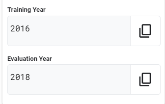

# [GSP341] Create ML Models with BigQuery ML: Challenge Lab


### [GSP341](https://www.cloudskillsboost.google/focuses/14294?parent=catalog)


---

Time: 1 hour 30 minutes<br>
Difficulty: Intermediate<br>
Price: 7 Credits

Quest: [Create ML Models with BigQuery ML](https://www.cloudskillsboost.google/quests/146)<br>

Last updated: May 20, 2023

---

## Challenge lab scenario

You have started a new role as a junior member of the Data Science department Jooli Inc. Your team is working on a number of machine learning initiatives related to urban mobility services. You are expected to help with the development and assessment of data sets and machine learning models to help provide insights based on real work data sets.

You are expected to have the skills and knowledge for these tasks, so don't expect step-by-step guides to be provided.

## Your challenge

One of the projects you are working on needs to provide analysis based on real world data that will help in the selection of new bicycle models for public bike share systems. Your role in this project is to develop and evaluate machine learning models that can predict average trip durations for bike schemes using the public data from Austin's public bike share scheme to train and evaluate your models.

Two of the senior data scientists in your team have different theories on what factors are important in determining the duration of a bike share trip and you have been asked to prioritise these to start. The first data scientist maintains that the key factors are the start station, the location of the start station, the day of the week and the hour the trip started. While the second data scientist argues that this is an over complication and the key factors are simply start station, subscriber type, and the hour the trip started.

You have been asked to develop a machine learning model based on each of these input features. Given the fact that stay-at-home orders were in place for Austin during parts of 2021 as a result of COVID-19 you will be working on data from previous years. You have been instructed to train your models on data from `Training Year` and then evaluate them against data from `Evaluation Year` on the basis of Mean Absolute Error and the square root of Mean Squared Error.

You can access the public data for the Austin bike share scheme in your project by opening [this link to the Austin bike share dataset](https://console.cloud.google.com/bigquery?p=bigquery-public-data&d=austin_bikeshare&page=dataset) in the browser tab for your lab.

As a final step you must create and run a query that uses the model that includes subscriber type as a feature, to predict the average trip duration for all trips from the busiest bike sharing station in `Evaluation Year` (based on the number of trips per station in `Evaluation Year`) where the subscriber type is 'Single Trip'.

## Setup

```bash
gcloud auth list

gcloud config list project
```

## Task 1. Create a dataset to store your machine learning models

- Create a new dataset in which you can store your machine learning models.

Go to your cloud shell and run the following command to create the model:

```bash
bq mk austin
```

## Task 2. Create a forecasting BigQuery machine learning model

- Create the first machine learning model to predict the trip duration for bike trips.

The features of this model must incorporate the starting station name, the hour the trip started, the weekday of the trip, and the address of the start station labeled as `location`. You must use `Training Year` data only to train this model.

Go to BigQuery to make the first model and run the following query:

Replace `<****Training_Year****>` with the year you are using for training.

The year in your lab variable looks like this:



```sql
CREATE OR REPLACE MODEL austin.location_model
OPTIONS
  (model_type='linear_reg', labels=['duration_minutes']) AS
SELECT
    start_station_name,
    EXTRACT(HOUR FROM start_time) AS start_hour,
    EXTRACT(DAYOFWEEK FROM start_time) AS day_of_week,
    duration_minutes,
    address as location
FROM
    `bigquery-public-data.austin_bikeshare.bikeshare_trips` AS trips
JOIN
    `bigquery-public-data.austin_bikeshare.bikeshare_stations` AS stations
ON
    trips.start_station_name = stations.name
WHERE
    EXTRACT(YEAR FROM start_time) = <****Training_Year****>
    AND duration_minutes > 0
```

## Task 3. Create the second machine learning model

- Create the second machine learning model to predict the trip duration for bike trips.

The features of this model must incorporate the starting station name, the bike share subscriber type and the start time for the trip. You must also use `Training Year` data only to train this model.

Go to BigQuery to make the second model and run the following query:

Replace `<****Training_Year****>` with the year you are using for training.

```sql
CREATE OR REPLACE MODEL austin.subscriber_model
OPTIONS
  (model_type='linear_reg', labels=['duration_minutes']) AS
SELECT
    start_station_name,
    EXTRACT(HOUR FROM start_time) AS start_hour,
    subscriber_type,
    duration_minutes
FROM `bigquery-public-data.austin_bikeshare.bikeshare_trips` AS trips
WHERE EXTRACT(YEAR FROM start_time) = <****Training_Year****>
```

## Task 4. Evaluate the two machine learning models

- Evaluate each of the machine learning models against `Evaluation Year` data only using separate queries.

Your queries must report both the Mean Absolute Error and the Root Mean Square Error.

Go to BigQuery and run the following query:

Replace `<****Evaluation_Year****>` with the year you are using for evaluating.

```sql
SELECT
  SQRT(mean_squared_error) AS rmse,
  mean_absolute_error
FROM
  ML.EVALUATE(MODEL austin.location_model, (
  SELECT
    start_station_name,
    EXTRACT(HOUR FROM start_time) AS start_hour,
    EXTRACT(DAYOFWEEK FROM start_time) AS day_of_week,
    duration_minutes,
    address as location
  FROM
    `bigquery-public-data.austin_bikeshare.bikeshare_trips` AS trips
  JOIN
   `bigquery-public-data.austin_bikeshare.bikeshare_stations` AS stations
  ON
    trips.start_station_name = stations.name
  WHERE EXTRACT(YEAR FROM start_time) = <****Evaluation_Year****> )
)
```

```sql
SELECT
  SQRT(mean_squared_error) AS rmse,
  mean_absolute_error
FROM
  ML.EVALUATE(MODEL austin.subscriber_model, (
  SELECT
    start_station_name,
    EXTRACT(HOUR FROM start_time) AS start_hour,
    subscriber_type,
    duration_minutes
  FROM
    `bigquery-public-data.austin_bikeshare.bikeshare_trips` AS trips
  WHERE
    EXTRACT(YEAR FROM start_time) = <****Evaluation_Year****>)
)
```

## Task 5. Use the subscriber type machine learning model to predict average trip durations

- When both models have been created and evaluated, use the second model, that uses `subscriber_type` as a feature, to predict average trip length for trips from the busiest bike sharing station in `Evaluation Year` where the subscriber type is `Single Trip`.

Go to BigQuery and run the following query:

Replace `<****Evaluation_Year****>` with the year you are using for evaluating.

```sql
SELECT
  start_station_name,
  COUNT(*) AS trips
FROM
  `bigquery-public-data.austin_bikeshare.bikeshare_trips`
WHERE
  EXTRACT(YEAR FROM start_time) = <****Evaluation_Year****>
GROUP BY
  start_station_name
ORDER BY
  trips DESC
```

```sql
SELECT AVG(predicted_duration_minutes) AS average_predicted_trip_length
FROM ML.predict(MODEL austin.subscriber_model, (
SELECT
    start_station_name,
    EXTRACT(HOUR FROM start_time) AS start_hour,
    subscriber_type,
    duration_minutes
FROM
  `bigquery-public-data.austin_bikeshare.bikeshare_trips`
WHERE
  EXTRACT(YEAR FROM start_time) = <****Evaluation_Year****>
  AND subscriber_type = 'Single Trip'
  AND start_station_name = '21st & Speedway @PCL'))
```

## Congratulations!


<div style="display: flex; justify-content: space-between;">
    <a style="text-align: left;" href="../GSP322/index.md"><= PREV (GSP322)</a>
    <a style="text-align: right;" href="../GSP342/index.md">NEXT (GSP342) =></a>
</div>
<br>

[HOME](../../README.md)
