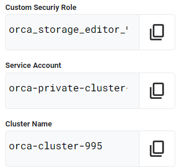

# [GSP342] Ensure Access & Identity in Google Cloud: Challenge Lab

### [GSP342](https://www.cloudskillsboost.google/focuses/14572?parent=catalog)


---

Time: 1 hour 30 minutes<br>
Difficulty: Intermediate<br>
Price: 5 Credits

Quest: [Ensure Access & Identity in Google Cloud](https://www.cloudskillsboost.google/quests/150)<br>

Last updated: May 26, 2023

---

## Challenge scenario

You have started a new role as a junior member of the security team for the Orca team in Jooli Inc. Your team is responsible for ensuring the security of the Cloud infrastucture and services that the company's applications depend on.

You are expected to have the skills and knowledge for these tasks, so don't expect step-by-step guides to be provided.

## Your challenge

You have been asked to deploy, configure, and test a new Kubernetes Engine cluster that will be used for application development and pipeline testing by the the Orca development team.

As per the organisation's security standards you must ensure that the new Kubernetes Engine cluster is built according to the organisation's most recent security standards and thereby must comply with the following:

- The cluster must be deployed using a dedicated service account configured with the least privileges required.
- The cluster must be deployed as a Kubernetes Engine private cluster, with the public endpoint disabled, and the master authorized network set to include only the ip-address of the Orca group's management jumphost.
- The Kubernetes Engine private cluster must be deployed to the `orca-build-subnet` in the Orca Build VPC.

From a previous project you know that the minimum permissions required by the service account that is specified for a Kubernetes Engine cluster is covered by these three built in roles:

- `roles/monitoring.viewer`
- `roles/monitoring.metricWriter`
- `roles/logging.logWriter`

These roles are specified in the Google Kubernetes Engine (GKE)'s Harden your cluster's security guide in the [Use least privilege Google service accounts](https://cloud.google.com/kubernetes-engine/docs/how-to/hardening-your-cluster#use_least_privilege_sa) section.

You must bind the above roles to the service account used by the cluster as well as a custom role that you must create in order to provide access to any other services specified by the development team. Initially you have been told that the development team requires that the service account used by the cluster should have the permissions necessary to add and update objects in Google Cloud Storage buckets. To do this you will have to create a new custom IAM role that will provide the following permissions:

- `storage.buckets.get`
- `storage.objects.get`
- `storage.objects.list`
- `storage.objects.update`
- `storage.objects.create`

Once you have created the new private cluster you must test that it is correctly configured by connecting to it from the jumphost, `orca-jumphost`, in the management subnet `orca-mgmt-subnet`. As this compute instance is not in the same subnet as the private cluster you must make sure that the master authorized networks for the cluster includes the internal ip-address for the instance, and you must specify the `--internal-ip` flag when retrieving cluster credentials using the `gcloud container clusters get-credentials` command.

All new cloud objects and services that you create should include the "orca-" prefix.

Your final task is to validate that the cluster is working correctly by deploying a simple application to the cluster to test that management access to the cluster using the `kubectl` tool is working from the `orca-jumphost` compute instance.

## Setup

Define variables:

```bash
export CUSTOM_SECURIY_ROLE=
export SERVICE_ACCOUNT=
export CLUSTER_NAME=
```

for example, in my case:



```bash
export CUSTOM_SECURIY_ROLE=orca_storage_editor_923
export SERVICE_ACCOUNT=orca-private-cluster-278-sa
export CLUSTER_NAME=orca-cluster-995
```

## Task 1. Create a custom security role.

Set the default zone to `us-east1-b` and create `role-definition.yaml` file.

```bash
gcloud config set compute/zone us-east1-b
```

Create `role-definition.yaml` file.

```bash
cat <<EOF > role-definition.yaml
title: "<TITLE>"
description: "<DESCRIPTION>"
stage: "ALPHA"
includedPermissions:
- storage.buckets.get
- storage.objects.get
- storage.objects.list
- storage.objects.update
- storage.objects.create
EOF
```

Replace `<TITLE>` and `<DESCRIPTION>` with the variables using [sed](https://linux.die.net/man/1/sed) command.

```bash
sed -i "s/<TITLE>/$CUSTOM_SECURIY_ROLE/g" role-definition.yaml
sed -i "s/<DESCRIPTION>/Permission/g" role-definition.yaml
```

Create a custom security role

```bash
gcloud iam roles create $CUSTOM_SECURIY_ROLE --project $DEVSHELL_PROJECT_ID --file role-definition.yaml
```

## Task 2. Create a service account.

```bash
gcloud iam service-accounts create $SERVICE_ACCOUNT --display-name "${SERVICE_ACCOUNT} Service Account"
```

## Task 3. Bind a custom security role to a service account.

```bash
gcloud projects add-iam-policy-binding $DEVSHELL_PROJECT_ID --member serviceAccount:$SERVICE_ACCOUNT@$DEVSHELL_PROJECT_ID.iam.gserviceaccount.com --role roles/monitoring.viewer

gcloud projects add-iam-policy-binding $DEVSHELL_PROJECT_ID --member serviceAccount:$SERVICE_ACCOUNT@$DEVSHELL_PROJECT_ID.iam.gserviceaccount.com --role roles/monitoring.metricWriter

gcloud projects add-iam-policy-binding $DEVSHELL_PROJECT_ID --member serviceAccount:$SERVICE_ACCOUNT@$DEVSHELL_PROJECT_ID.iam.gserviceaccount.com --role roles/logging.logWriter

gcloud projects add-iam-policy-binding $DEVSHELL_PROJECT_ID --member serviceAccount:$SERVICE_ACCOUNT@$DEVSHELL_PROJECT_ID.iam.gserviceaccount.com --role projects/$DEVSHELL_PROJECT_ID/roles/$CUSTOM_SECURIY_ROLE
```

## Task 4. Create and configure a new Kubernetes Engine private cluster

```bash
gcloud config set compute/zone us-east1-b

gcloud container clusters create $CLUSTER_NAME --num-nodes 1 --master-ipv4-cidr=172.16.0.64/28 --network orca-build-vpc --subnetwork orca-build-subnet --enable-master-authorized-networks  --master-authorized-networks 192.168.10.2/32 --enable-ip-alias --enable-private-nodes --enable-private-endpoint --service-account $SERVICE_ACCOUNT@$DEVSHELL_PROJECT_ID.iam.gserviceaccount.com --zone us-east1-b
```

## Task 5. Deploy an application to a private Kubernetes Engine cluster.

Connect to the `orca-jumphost` compute instance (SSH).

```bash
gcloud compute ssh --zone "us-east1-b" "orca-jumphost"
```

Define variables:

```bash
export CUSTOM_SECURIY_ROLE=
export SERVICE_ACCOUNT=
export CLUSTER_NAME=
```

for example, in my case:


```bash
export CUSTOM_SECURIY_ROLE=orca_storage_editor_923
export SERVICE_ACCOUNT=orca-private-cluster-278-sa
export CLUSTER_NAME=orca-cluster-995
```

Install the [gcloud auth plugin for Kubernetes](https://cloud.google.com/blog/products/containers-kubernetes/kubectl-auth-changes-in-gke):

```bash
sudo apt-get install google-cloud-sdk-gke-gcloud-auth-plugin
```

Create and expose a deployment in Kubernetes:

```bash
gcloud container clusters get-credentials $CLUSTER_NAME --zone=us-east1-b --internal-ip

kubectl create deployment hello-server --image=gcr.io/google-samples/hello-app:1.0

kubectl expose deployment hello-server --name orca-hello-service --type LoadBalancer --port 80 --target-port 8080
```

## Congratulations!


