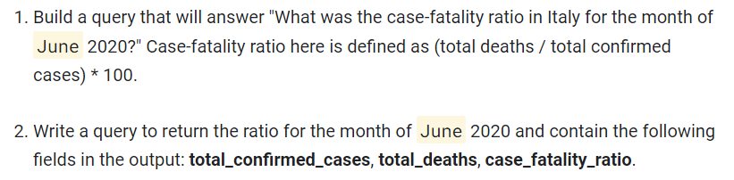
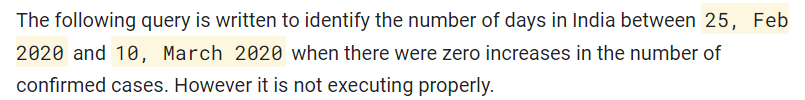
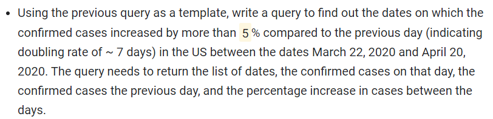

# [GSP787] Insights from Data with BigQuery: Challenge Lab

### [GSP787](https://www.cloudskillsboost.google/focuses/14294?parent=catalog)


---

Time: 1 hour<br>
Difficulty: Intermediate<br>
Price: 5 Credits

Quest: [Insights from Data with BigQuery](https://www.cloudskillsboost.google/quests/123)<br>

Last updated: May 20, 2023

---

## Challenge lab scenario

You're part of a public health organization which is tasked with identifying answers to queries related to the Covid-19 pandemic. Obtaining the right answers will help the organization in planning and focusing healthcare efforts and awareness programs appropriately.

The dataset and table that will be used for this analysis will be : `bigquery-public-data.covid19_open_data.covid19_open_data`. This repository contains country-level datasets of daily time-series data related to COVID-19 globally. It includes data relating to demographics, economy, epidemiology, geography, health, hospitalizations, mobility, government response, and weather.

## Task 1. Total confirmed cases

- Build a query that will answer "What was the total count of confirmed cases on `Date`?" The query needs to return a single row containing the sum of confirmed cases across all countries. The name of the column should be **total_cases_worldwide**.

Columns to reference:

- cumulative_confirmed
- date

Go to BigQuery and run the following query:

Change the `date` based on the lab instructions.


```sql
SELECT sum(cumulative_confirmed) as total_cases_worldwide
FROM `bigquery-public-data.covid19_open_data.covid19_open_data`
WHERE date=<****change date eg '2020-05-15'****>
```

Mine is `May, 15 2020`. So, I will change the date to `2020-05-15`.

example:

```sql
SELECT sum(cumulative_confirmed) as total_cases_worldwide
FROM `bigquery-public-data.covid19_open_data.covid19_open_data`
WHERE date='2020-05-15'
```

## Task 2. Worst affected areas

- Build a query for answering "How many states in the US had more than `Death Count` deaths on `Date`?" The query needs to list the output in the field **count_of_states**.

> **Note**: Don't include NULL values.

Columns to reference:

- country_name
- subregion1_name (for state information)
- cumulative_deceased

Go to BigQuery and run the following query:

Change the `date` and `death_count` based on the lab instructions.

```sql
with deaths_by_states as (
    SELECT subregion1_name as state, sum(cumulative_deceased) as death_count
    FROM `bigquery-public-data.covid19_open_data.covid19_open_data`
    where country_name="United States of America" and date=<****change date eg '2020-05-15'****> and subregion1_name is NOT NULL
    group by subregion1_name
)
select count(*) as count_of_states
from deaths_by_states
where death_count > <****change death count here****>
```

Mine is `250` deaths. So, I will change the `death_count` to `250`.


example:

```sql
with deaths_by_states as (
    SELECT subregion1_name as state, sum(cumulative_deceased) as death_count
    FROM `bigquery-public-data.covid19_open_data.covid19_open_data`
    where country_name="United States of America" and date='2020-05-15' and subregion1_name is NOT NULL
    group by subregion1_name
)
select count(*) as count_of_states
from deaths_by_states
where death_count > 250
```

## Task 3. Identifying hotspots

- Build a query that will answer "List all the states in the United States of America that had more than `Confirmed Cases` confirmed cases on `Date`?" The query needs to return the State Name and the corresponding confirmed cases arranged in descending order. Name of the fields to return state and **total_confirmed_cases**.

Columns to reference:

- country_code
- subregion1_name (for state information)
- cumulative_confirmed

Go to BigQuery and run the following query:

```sql
SELECT * FROM (
    SELECT subregion1_name as state, sum(cumulative_confirmed) as total_confirmed_cases
    FROM `bigquery-public-data.covid19_open_data.covid19_open_data`
    WHERE country_code="US" AND date=<****change date eg '2020-05-15'****> AND subregion1_name is NOT NULL
    GROUP BY subregion1_name
    ORDER BY total_confirmed_cases DESC
)
WHERE total_confirmed_cases > <****change confirmed case here****>
```

## Task 4. Fatality ratio

1. Build a query that will answer "What was the case-fatality ratio in Italy for the month of Month 2020?" Case-fatality ratio here is defined as (total deaths / total confirmed cases) * 100.

2. Write a query to return the ratio for the month of Month 2020 and contain the following fields in the output: total_confirmed_cases, total_deaths, case_fatality_ratio.

Columns to reference:

- country_name
- cumulative_confirmed
- cumulative_deceased

Go to BigQuery and run the following query:

```sql
SELECT sum(cumulative_confirmed) as total_confirmed_cases, sum(cumulative_deceased) as total_deaths, (sum(cumulative_deceased)/sum(cumulative_confirmed))*100 as case_fatality_ratio
FROM `bigquery-public-data.covid19_open_data.covid19_open_data`
where country_name="Italy" AND date BETWEEN <****change month here '2020-06-01'****> and <****change month here '2020-06-30'****>
```

Change the `month` based on the lab instructions.



Mine is `June, 2020`. So, I will change the month to `2020-06-01` and `2020-06-30`.

example:

```sql
SELECT sum(cumulative_confirmed) as total_confirmed_cases, sum(cumulative_deceased) as total_deaths, (sum(cumulative_deceased)/sum(cumulative_confirmed))*100 as case_fatality_ratio
FROM `bigquery-public-data.covid19_open_data.covid19_open_data`
where country_name="Italy" AND date BETWEEN '2020-06-01' and '2020-06-30'
```

## Task 5. Identifying specific day

- Build a query that will answer: "On what day did the total number of deaths cross `Death count in Italy` in Italy?" The query should return the date in the format **yyyy-mm-dd**.

Columns to reference:

- country_name
- cumulative_deceased

Go to BigQuery and run the following query:

```sql
SELECT date
FROM `bigquery-public-data.covid19_open_data.covid19_open_data`
where country_name="Italy" and cumulative_deceased> <****change the value of death cross****>
order by date asc
limit 1
```

## Task 6. Finding days with zero net new cases

The following query is to identify the number of days in India between `Start date in India` and `Close date in India` when there were zero increases in the number of confirmed cases.

Go to BigQuery and run the following query:

```sql
WITH india_cases_by_date AS (
  SELECT
    date,
    SUM( cumulative_confirmed ) AS cases
  FROM
    `bigquery-public-data.covid19_open_data.covid19_open_data`
  WHERE
    country_name ="India"
    AND date between < ****change the date here'2020-02-21'****> and <****change the date here'2020-03-15'****>
  GROUP BY
    date
  ORDER BY
    date ASC
 )
, india_previous_day_comparison AS
(SELECT
  date,
  cases,
  LAG(cases) OVER(ORDER BY date) AS previous_day,
  cases - LAG(cases) OVER(ORDER BY date) AS net_new_cases
FROM india_cases_by_date
)
select count(*)
from india_previous_day_comparison
where net_new_cases=0
```

Change the `start date` in India and `close date` in India based on the lab instructions.



Mine is `25, Feb 2020` and `10, March 2020`. So, I will change the date to `2020-02-25` and `2020-03-10`.

example:

```sql
WITH india_cases_by_date AS (
  SELECT
    date,
    SUM( cumulative_confirmed ) AS cases
  FROM
    `bigquery-public-data.covid19_open_data.covid19_open_data`
  WHERE
    country_name ="India"
    AND date between '2020-02-25' and '2020-03-10'
  GROUP BY
    date
  ORDER BY
    date ASC
 )
, india_previous_day_comparison AS
(SELECT
  date,
  cases,
  LAG(cases) OVER(ORDER BY date) AS previous_day,
  cases - LAG(cases) OVER(ORDER BY date) AS net_new_cases
FROM india_cases_by_date
)
select count(*)
from india_previous_day_comparison
where net_new_cases=0
```

## Task 7. Doubling rate

- Using the previous query as a template, write a query to find out the dates on which the confirmed cases increased by more than `Limit Value`% compared to the previous day (indicating doubling rate of ~ 7 days) in the US between the dates March 22, 2020 and April 20, 2020. The query needs to return the list of dates, the confirmed cases on that day, the confirmed cases the previous day, and the percentage increase in cases between the days.
  - Use the following names for the returned fields: **Date**, **Confirmed_Cases_On_Day**, **Confirmed_Cases_Previous_Day**, and **Percentage_Increase_In_Cases**.

Go to BigQuery and run the following query:

Change the `Limit Value` based on the lab instructions.



Mine is `5`% so, I will change the value to `5`.

```sql
WITH us_cases_by_date AS (
  SELECT
    date,
    SUM(cumulative_confirmed) AS cases
  FROM
    `bigquery-public-data.covid19_open_data.covid19_open_data`
  WHERE
    country_name="United States of America"
    AND date between '2020-03-22' and '2020-04-20'
  GROUP BY
    date
  ORDER BY
    date ASC
 )
, us_previous_day_comparison AS
(SELECT
  date,
  cases,
  LAG(cases) OVER(ORDER BY date) AS previous_day,
  cases - LAG(cases) OVER(ORDER BY date) AS net_new_cases,
  (cases - LAG(cases) OVER(ORDER BY date))*100/LAG(cases) OVER(ORDER BY date) AS percentage_increase
FROM us_cases_by_date
)
select Date, cases as Confirmed_Cases_On_Day, previous_day as Confirmed_Cases_Previous_Day, percentage_increase as Percentage_Increase_In_Cases
from us_previous_day_comparison
where percentage_increase > <****change percentage value here****>
```

## Task 8. Recovery rate

1. Build a query to list the recovery rates of countries arranged in descending order (limit to `Limit Value`) upto the date May 10, 2020.

2. Restrict the query to only those countries having more than 50K confirmed cases.
   - The query needs to return the following fields: `country`, `recovered_cases`, `confirmed_cases`, `recovery_rate`.

Columns to reference:

- country_name
- cumulative_confirmed
- cumulative_recovered

Go to BigQuery and run the following query:

Change the `limit` based on the lab instructions.


Mine is `5` so, I will change the value to `5`.

```sql
WITH cases_by_country AS (
  SELECT
    country_name AS country,
    sum(cumulative_confirmed) AS cases,
    sum(cumulative_recovered) AS recovered_cases
  FROM
    bigquery-public-data.covid19_open_data.covid19_open_data
  WHERE
    date = '2020-05-10'
  GROUP BY
    country_name
 )
, recovered_rate AS
(SELECT
  country, cases, recovered_cases,
  (recovered_cases * 100)/cases AS recovery_rate
FROM cases_by_country
)
SELECT country, cases AS confirmed_cases, recovered_cases, recovery_rate
FROM recovered_rate
WHERE cases > 50000
ORDER BY recovery_rate desc
LIMIT <****change limit here****>
```

## Task 9. CDGR - Cumulative daily growth rate

- The following query is trying to calculate the CDGR on `Date` (Cumulative Daily Growth Rate) for France since the day the first case was reported.The first case was reported on Jan 24, 2020.
- The CDGR is calculated as:
  `((last_day_cases/first_day_cases)^1/days_diff)-1)`

Where :

- `last_day_cases` is the number of confirmed cases on May 10, 2020
- `first_day_cases` is the number of confirmed cases on Jan 24, 2020
- `days_diff` is the number of days between Jan 24 - May 10, 2020

Go to BigQuery and run the following query:

```sql
WITH
  france_cases AS (
  SELECT
    date,
    SUM(cumulative_confirmed) AS total_cases
  FROM
    `bigquery-public-data.covid19_open_data.covid19_open_data`
  WHERE
    country_name="France"
    AND date IN ('2020-01-24',
      <****change the date value here'2020-05-10'****>)
  GROUP BY
    date
  ORDER BY
    date)
, summary as (
SELECT
  total_cases AS first_day_cases,
  LEAD(total_cases) OVER(ORDER BY date) AS last_day_cases,
  DATE_DIFF(LEAD(date) OVER(ORDER BY date),date, day) AS days_diff
FROM
  france_cases
LIMIT 1
)
select first_day_cases, last_day_cases, days_diff, POW((last_day_cases/first_day_cases),(1/days_diff))-1 as cdgr
from summary
```

## Task 10. Create a Looker Studio report

- Create a [Looker Studio](https://datastudio.google.com/) report that plots the following for the United States:
  - Number of Confirmed Cases
  - Number of Deaths
  - Date range : `Date Range`

Change the `Date Range` based on the lab instructions.


```sql
SELECT
  date, SUM(cumulative_confirmed) AS country_cases,
  SUM(cumulative_deceased) AS country_deaths
FROM
  `bigquery-public-data.covid19_open_data.covid19_open_data`
WHERE
  date BETWEEN <****change the date value here'2020-03-19'****>
  AND <****change the date value here'2020-04-22'****>
  AND country_name ="United States of America"
GROUP BY date
```

Mine is `2020-03-19` to `2020-04-22`. It should look like this:

```sql
SELECT
  date, SUM(cumulative_confirmed) AS country_cases,
  SUM(cumulative_deceased) AS country_deaths
FROM
  `bigquery-public-data.covid19_open_data.covid19_open_data`
WHERE
  date BETWEEN '2020-03-19'
  AND '2020-04-22'
  AND country_name ="United States of America"
GROUP BY date
```

## Congratulations!


<div style="display: flex; justify-content: space-between;">
    <a style="text-align: left;" href="../GSP345/index.md"><= PREV (GSP345)</a>
</div>
<br>

[HOME](../../README.md)
